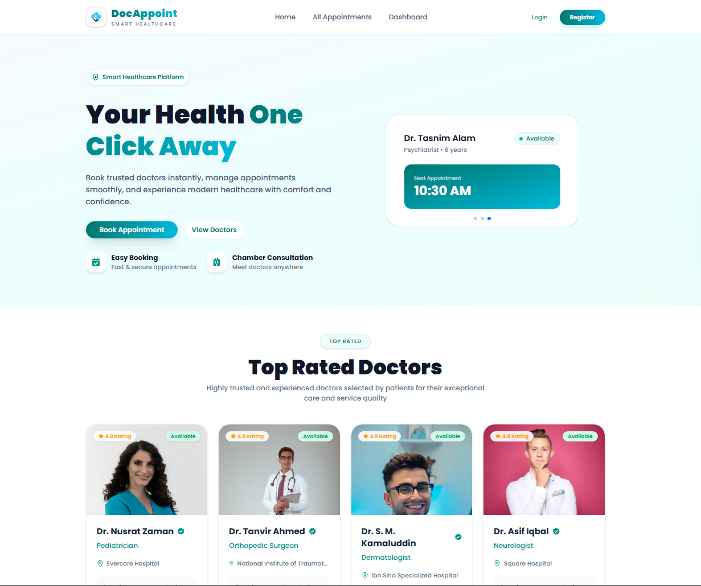
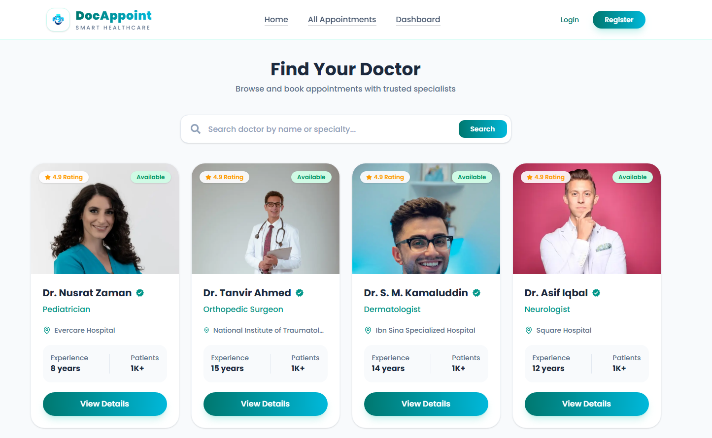
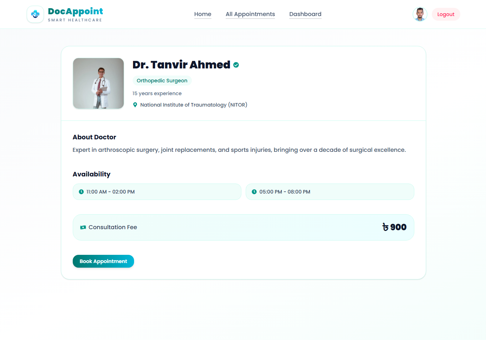
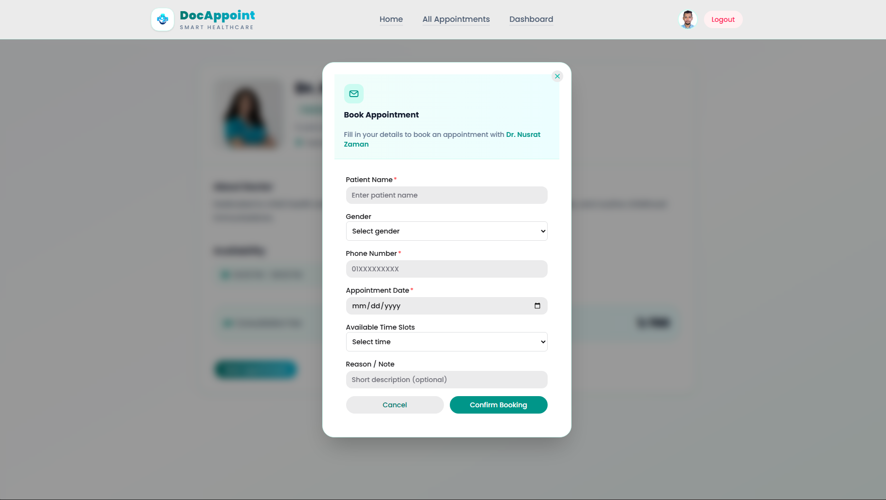
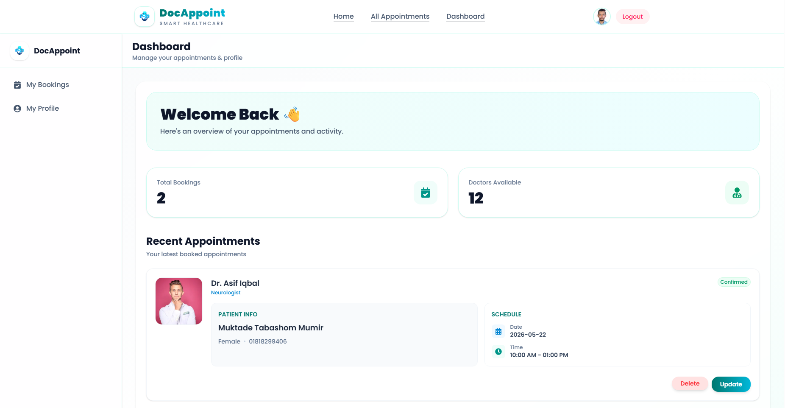
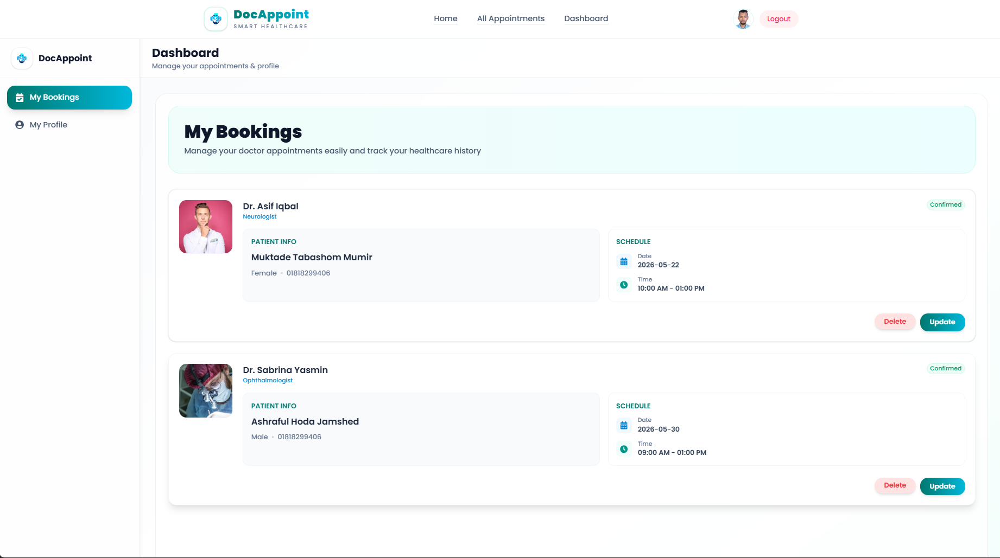
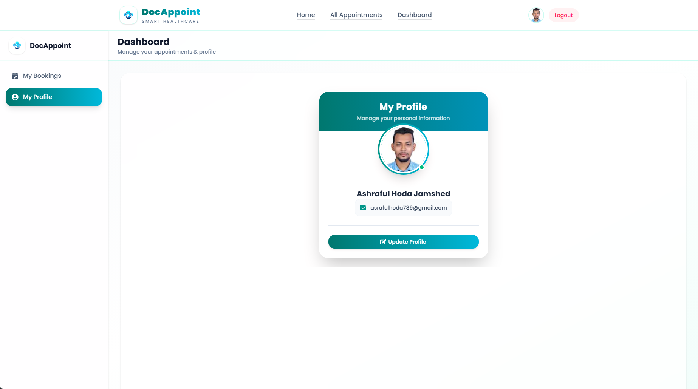

# DocAppoint - Doctor Appointment System

A modern full-stack **Doctor Appointment Booking System** built with **Next.js, Node.js, Express.js, Better Auth, MongoDB, and Tailwind CSS**.

This platform streamlines healthcare access by allowing patients to seamlessly discover specialists, book secure appointments, and manage consultations through an intuitive dashboard interface.

---

## Live Links

- **Live Preview:** [https://doc-appoint-one.vercel.app](https://doc-appoint-one.vercel.app)

---

## ✨ Core Features

### 👤 Patient Portal
- **Advanced Authentication**: Secure sign-up/sign-in powered by Better Auth.
- **Doctor Directory**: Browse verified doctor profiles filtered by specialization and availability.
- **Streamlined Booking**: Effortless slot booking system with real-time confirmation.
- **Appointment Tracking**: Dedicated hub to view, reschedule, or cancel bookings.
- **Profile Management**: Dynamic user profile updates (name, avatar, and contact info).

### 📊 Dashboard System
- **Real-time Overview**: Key statistics regarding upcoming and past consultations.
- **Management Center**: Centralized control for booking history and personal credentials.
- **Responsive Navigation**: Clean, collapsible sidebar designed for seamless UX.

---

## 🎨 User Interface Preview

### Landing Page & Doctor Discovery
<p align="center">
  
</p>

<p align="center">
  
</p>

---

### Booking & Consultation Flow
<p align="center">
  
</p>

<p align="center">
  
</p>

---

### User Dashboard
<p align="center">
  
</p>

<p align="center">
 
</p>

<p align="center">
  
</p>

---

## 🛠️ Tech Stack & Architecture

### **Frontend**
- **[Next.js](https://nextjs.org/)** (App Router) – Server-side rendering and optimal performance routing.
- **[Tailwind CSS](https://tailwindcss.com/)** – Utility-first responsive styling framework.
- **[HeroUI](https://www.heroui.com/)** & **Lucide Icons** – Modern UI components and iconography.

### **Backend & Database**
- **[Node.js](https://nodejs.org/) & [Express.js](https://expressjs.com/)** – Scalable RESTful API architecture.
- **[MongoDB](https://www.mongodb.com/)** – Flexible NoSQL database for structured user and booking records.
- **[Better Auth](https://www.better-auth.com/)** – Robust, modern session management and authentication.

---

## Packages Used 
```
npm install better-auth @better-auth/mongo-adapter mongodb @heroui/react lucide-react react-icons
```
---
## Author
### Ashraful Hoda Jamshed
